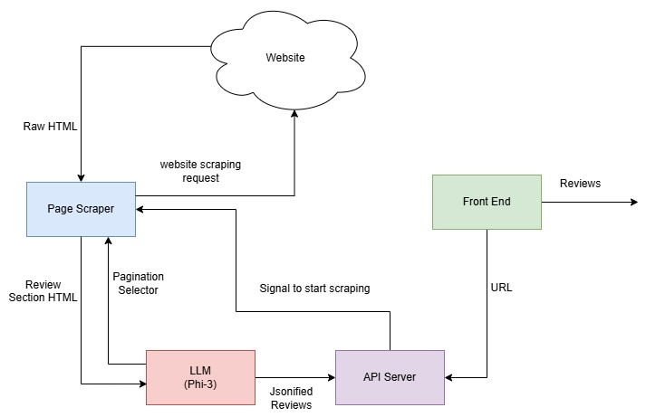
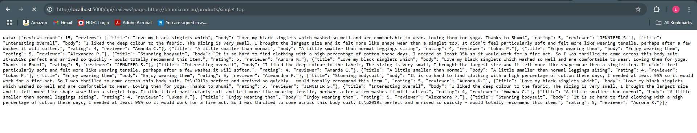
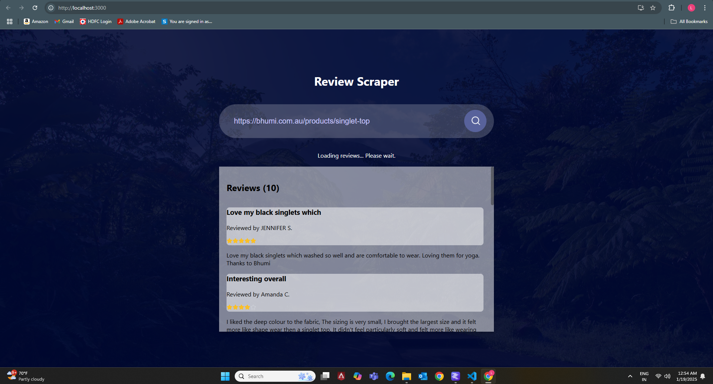

# **Approach**
1. We first scrape the review page entirely and filter only the review section of the HTML source code using various heuristics (the substring of class names or the inner html text containing various words like "reviews", "Product Reviews", etc).
2. We then prompt the language model to extract the selector name for pagination from the HTML code.
3. Once we have the name of the pagination element in the background thread we keep scraping the review section of the html and add it to a queue.
4. In the foreground we pop the html source code from the queue and pass it to a language model to generate the reviews in the required format.
5. We maintain an object which keeps track of the processed reviews and updates the API whenever it detects a change.

# **Steps to run**
**Note: Extract the backend and frontend directory first (backend.zip, frontend.zip)**
1. In the **"backend"** directory open terminal and run "pip install -r requirements.txt"
2. In the **"review_api"** directory in the terminal run "npm config set legacy-peer-deps true", next in the same terminal run "npm install" (Do this step only if you need frontend, may not work)
3. In **lm-studio**(or any llm server which supports OpenAI type client connection, modify the client in llm_summarizer.py file and page_scrapper.py file accordingly) load **meta-llama-3.1-8b-instruct** model with the following parameters: 
    - context length: 9000
    - temperature: 0
    - top-p sampling:0 (if present) 
    - top-k sampling:0 (if present)
    - min p sampling: 0 (if present)
    - repeat penalty: disabled or 0
3. In the "backend" directory terminal run "python app.py"
4. In the "review_api" directory run "npm start" (For the frontend,  runs in localhost:3000)
5. Access the api endpoint by typing "http://localhost:5000/api/reviews?page={your_url}", for example: "http://localhost:5000/api/reviews?page=https://lyfefuel.com/products/essentials-nutrition-shake" In the browser
6. In the front end just type the url in the search bar and click the search button, the front end keeps loading and dynamically renders new content whenever the API endpoint is updated
7. If you want to extract the reviews from new url just type the new url in the searchbar and search.
8. If you want to stop the server, ctrl+c in the terminal running the backend server.

**Note: Since the llm model runs locally, it takes really long to extract the pagination element and generate reviews so wait atleast 5-10 minutes (longer if your system does not have a good GPU) until new content is generated, opionally if you have access to Open AI service just change the client connection to the openai service in the llm_summarizer.py file and page_scrapper.py file** 

# **Architecture**

# **Screenshots**
## 1. API Endpoint

## 2. Frontend

